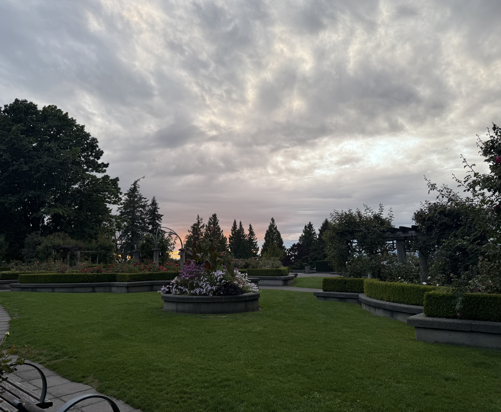

Orientation was a lot of fun, although it was also a little overwhelming with the amount of information we received. It gave me a much better understanding of what to expect from the program, especially in terms of the fast course pacing and the importance of always staying up to date with everything.

I’ve also made a few great friends so far, and they’re incredibly smart. They’ve already helped me better understand some of the more challenging tasks we’ve encountered in our labs, which has made adjusting to the program a lot easier.